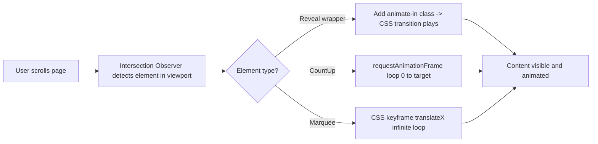

# Website Animation System — Implementation Plan

## Goal

Transform the entire Loxon Philippines website from "dull/static" to interactive and animative:

1. **Scroll-triggered reveal** — every section, card, heading, and content block fades/slides/scales in *when it enters the viewport*, not on page load.
2. **Count-up numbers** — statistics (Projects Completed, Years of Excellence, etc.) animate from 0 → target value when scrolled into view.
3. **Logo marquee** — partner/client logos scroll continuously left-to-right in an infinite loop.
4. **Respect accessibility** — honor `prefers-reduced-motion` so users who disable motion get instant content (no animation).

---

## Architecture Decision: Custom Lightweight (No New Dependencies)

The project currently has minimal dependencies (Next.js, React, Tailwind, lucide-react, pg, resend). To keep the bundle small and avoid dependency management overhead, we build **three small reusable client components** using the native **Intersection Observer API** and **requestAnimationFrame**.

| Option | Pros | Cons |
|--------|------|------|
| **Custom (chosen)** | Zero new deps, ~3 small files, full control, tiny bundle | We write the observer logic ourselves |
| framer-motion | Powerful, `whileInView` built-in | +50kb, overkill for fade/slide/count |

The custom approach covers 100% of the requested effects and keeps the site fast.

---

## System Overview



---

## New Components to Create

### 1. `src/components/Reveal.tsx` — Scroll-Triggered Reveal Wrapper

A client component that wraps any content and animates it in when it enters the viewport.

**Props:**
- `animation`: `'fade-up' | 'fade-down' | 'fade-left' | 'fade-right' | 'scale' | 'blur'` (default: `'fade-up'`)
- `delay`: number in ms (default: `0`) — staggered entrance for grids
- `duration`: number in ms (default: `700`)
- `threshold`: float 0–1 (default: `0.15`) — how much of element must be visible
- `once`: boolean (default: `true`) — animate only first time, or every time it re-enters
- `className`: string — pass-through classes
- `as`: element tag (default: `'div'`)

**How it works:**
1. Renders children inside a wrapper div with an initial hidden state (opacity 0 + transform).
2. Uses `useRef` + `useEffect` to attach an `IntersectionObserver`.
3. When intersecting, toggles a state that swaps hidden → visible classes (CSS transition handles the motion).
4. If `prefers-reduced-motion` is set, renders children with no hidden state (instant).

### 2. `src/components/CountUp.tsx` — Animated Number Counter

A client component that counts from 0 to a target number when scrolled into view.

**Props:**
- `end`: number (required) — target value
- `duration`: number in ms (default: `2000`)
- `suffix`: string (default: `''`) — e.g. `'+'`
- `prefix`: string (default: `''`)
- `decimals`: number (default: `0`)
- `className`: string

**How it works:**
1. Uses Intersection Observer to detect when the number is visible.
2. On enter, runs a `requestAnimationFrame` loop with an ease-out curve from 0 → `end`.
3. Updates the displayed number each frame.
4. Respects `prefers-reduced-motion` (shows final value instantly).

### 3. `src/components/Marquee.tsx` — Infinite Logo Scroller

A client component that scrolls its children horizontally in a seamless infinite loop.

**Props:**
- `children`: ReactNode — the logo items
- `speed`: number in seconds (default: `30`) — duration of one full loop
- `direction`: `'left' | 'right'` (default: `'left'`)
- `pauseOnHover`: boolean (default: `true`)
- `className`: string

**How it works:**
1. Renders the children **twice** side-by-side inside a flex track.
2. A CSS `@keyframes marquee` translates the track from `0` to `-50%` (since content is duplicated, this creates a seamless loop).
3. `pauseOnHover` adds a CSS rule that sets `animation-play-state: paused` on hover.
4. Respects `prefers-reduced-motion` (renders static, no scroll).

---

## CSS Changes — `src/app/globals.css`

Add the following:

### Reveal animation utility classes
```css
/* Hidden initial states (applied before intersection) */
.reveal-hidden { opacity: 0; transition-property: opacity, transform, filter; }
.reveal-hidden.fade-up    { transform: translateY(40px); }
.reveal-hidden.fade-down  { transform: translateY(-40px); }
.reveal-hidden.fade-left  { transform: translateX(40px); }
.reveal-hidden.fade-right { transform: translateX(-40px); }
.reveal-hidden.scale      { transform: scale(0.92); }
.reveal-hidden.blur      { filter: blur(10px); }

/* Visible state (applied when intersecting) */
.reveal-visible { opacity: 1; transform: none; filter: none; }
```

### Marquee keyframes
```css
@keyframes marquee {
  0%   { transform: translateX(0); }
  100% { transform: translateX(-50%); }
}
@keyframes marquee-reverse {
  0%   { transform: translateX(-50%); }
  100% { transform: translateX(0); }
}
.marquee-track { animation: marquee var(--marquee-duration) linear infinite; }
.marquee-track.reverse { animation-name: marquee-reverse; }
.marquee-container:hover .marquee-track { animation-play-state: paused; }
```

### Reduced motion
```css
@media (prefers-reduced-motion: reduce) {
  .reveal-hidden { opacity: 1 !important; transform: none !important; filter: none !important; }
  .marquee-track { animation: none !important; }
}
```

### Cleanup
- Remove the old `animate-fade-in-up`, `animate-fade-in-right`, `animate-fade-in-left` classes that fire on load (they are replaced by scroll-triggered `Reveal`).
- Keep `animate-bounce-slow`, `animate-pulse-slow`, `animate-slow-zoom` (used by hero scroll indicator and hero image).

---

## File-by-File Changes

### New files
| File | Purpose |
|------|---------|
| `src/components/Reveal.tsx` | Scroll-triggered reveal wrapper |
| `src/components/CountUp.tsx` | Animated number counter |
| `src/components/Marquee.tsx` | Infinite logo scroller |

### Modified files
| File | Change |
|------|--------|
| `src/app/globals.css` | Add reveal/marquee CSS, reduced-motion, remove old load-firing animation classes |
| `src/app/page.tsx` | Wrap all sections in `<Reveal>`, replace stat numbers with `<CountUp>`, replace static partner grid with `<Marquee>` |
| `src/app/our-company/page.tsx` | Wrap sections in `<Reveal>` (convert from server to client or use Reveal wrapper which is client-safe) |
| `src/app/products-services/page.tsx` | Wrap items in `<Reveal>` with staggered delays |
| `src/app/projects/page.tsx` | Wrap grid items in `<Reveal>` (inside ProjectsGrid client component) |
| `src/app/company-membership/page.tsx` | Wrap cards in `<Reveal>`, optionally use `<Marquee>` for partner logos |
| `src/app/contact/page.tsx` | Wrap form and info sections in `<Reveal>` |
| `src/app/join-us/page.tsx` | Wrap job listings in `<Reveal>` |
| `src/components/ProjectsGrid.tsx` | Wrap each project card in `<Reveal>` with staggered delay |
| `src/components/FeaturedProjects.tsx` | Wrap each project card in `<Reveal>` with staggered delay |
| `src/components/JobListings.tsx` | Replace `animate-fade-in-up` className with `<Reveal>` wrapper |
| `src/components/ClientsStrip.tsx` | Replace static flex with `<Marquee>` for infinite scroll |

### Server Component Compatibility
`Reveal`, `CountUp`, and `Marquee` are client components (`'use client'`). They can be **imported into server components** (pages like `page.tsx`, `our-company/page.tsx`) and used as wrappers — Next.js handles the client/server boundary automatically. No page needs to be converted to a client component.

---

## Animation Mapping by Page

### Home (`/`)
| Section | Animation | Details |
|---------|-----------|---------|
| Hero | (keep existing) | Already animates on load — correct for above-the-fold |
| Stats — Projects Completed | `CountUp` end={projects.length} suffix="+" | Count from 0 |
| Stats — Years of Excellence | `CountUp` end={43} suffix="+" | Count from 0 |
| About — text block | `Reveal animation="fade-right"` | Slide in from left |
| About — cert cards | `Reveal animation="fade-left"` delay stagger | Slide in from right |
| Core Capabilities heading | `Reveal animation="fade-up"` | |
| Core Capabilities cards | `Reveal animation="fade-up"` delay={idx*100} | Staggered |
| Featured Projects heading | `Reveal animation="fade-up"` | |
| Featured Projects cards | `Reveal animation="fade-up"` delay stagger | Staggered |
| Partners heading | `Reveal animation="fade-up"` | |
| Partners logos | `Marquee` | Single row, infinite left-to-right scroll, pause on hover (confirmed) |
| CTA section | `Reveal animation="scale"` | Scale in |

### Other pages
All hero sections stay as-is (above the fold). All content below the hero gets `Reveal` wrappers with appropriate directions and staggered delays for grids.

---

## Implementation Order

1. Add CSS (reveal classes, marquee keyframes, reduced-motion) to `globals.css`
2. Create `Reveal.tsx`
3. Create `CountUp.tsx`
4. Create `Marquee.tsx`
5. Update `ClientsStrip.tsx` to use Marquee
6. Update Home page (`page.tsx`) — Reveal + CountUp + Marquee
7. Update `FeaturedProjects.tsx` and `ProjectsGrid.tsx` — Reveal on cards
8. Update `our-company/page.tsx` — Reveal on sections
9. Update `products-services/page.tsx` — Reveal on items
10. Update `company-membership/page.tsx` — Reveal on cards
11. Update `contact/page.tsx` — Reveal on form/info
12. Update `join-us/page.tsx` + `JobListings.tsx` — Reveal on listings
13. Build & verify no errors
