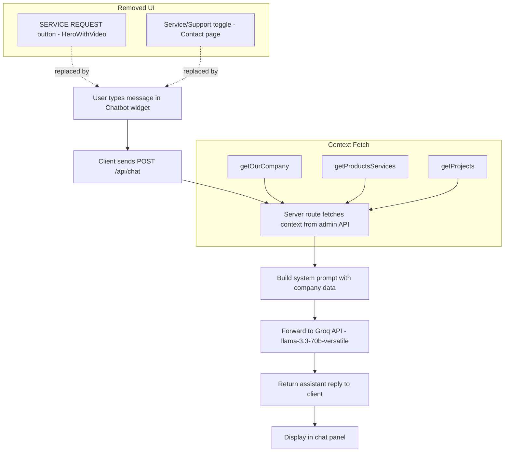

# Customer Service Chatbot — Architectural Plan

## Overview

Add a floating customer service chatbot to the Loxon Philippines website, accessible on all pages. Powered by Groq's `llama-3.3-70b-versatile` model with live company context fetched from the admin API. Replaces the "SERVICE REQUEST" button on the home hero and the "Service / Support" toggle on the contact form.

## Architecture Diagram



## Key Decisions

- **Model**: `llama-3.3-70b-versatile` via Groq API (OpenAI-compatible endpoint)
- **API key**: `GROQ_API_KEY` already in [`loxon-ph/.env.local`](loxon-ph/.env.local) — server-side only, never exposed to client
- **Context source**: Server-side fetch from admin API (`https://loxon-admin.vercel.app`) using existing helpers in [`loxon-ph/src/lib/api.ts`](loxon-ph/src/lib/api.ts)
- **Contact form simplification**: Remove inquiry type toggle entirely; backend API already defaults `inquiryType` to `'sales'`
- **Chatbot position**: Fixed bottom-right, `z-50`; BackToTop button moves up to `bottom-24` to avoid overlap

## Implementation Steps

### Step 1: Create Chatbot API Route (NEW FILE)

**File**: [`loxon-ph/src/app/api/chat/route.ts`](loxon-ph/src/app/api/chat/route.ts)

A POST endpoint that:
- Receives `{ messages: Array<{role, content}> }` from the client
- Fetches company context from the admin API using existing helpers:
  - [`getOurCompany()`](loxon-ph/src/lib/api.ts:33) — company description and sections
  - [`getProductsServices()`](loxon-ph/src/lib/api.ts:17) — list of services with descriptions
  - [`getProjects()`](loxon-ph/src/lib/api.ts:9) — notable projects (titles, types, locations)
- Builds a **system prompt** that includes:
  - Loxon Philippines identity, contact info (address, phone, email, business hours)
  - Company description and sections from our-company data
  - List of products and services with descriptions
  - Summary of notable projects (titles, types, locations)
  - Instructions: be professional, concise, helpful; direct sales inquiries needing human follow-up to the contact form; handle service/support questions directly
- Forwards to Groq API (`https://api.groq.com/openai/v1/chat/completions`) with model `llama-3.3-70b-versatile`, using `GROQ_API_KEY` from env
- Returns `{ reply: string }` to the client
- Includes basic error handling (returns 500 with error message on failure)

### Step 2: Add API Helper (MODIFY)

**File**: [`loxon-ph/src/lib/api.ts`](loxon-ph/src/lib/api.ts)

Add a `sendChatMessage` function following the existing pattern of [`submitContactForm`](loxon-ph/src/lib/api.ts:67):

```typescript
export async function sendChatMessage(messages: Array<{ role: string; content: string }>) {
  const res = await fetch('/api/chat', {
    method: 'POST',
    headers: { 'Content-Type': 'application/json' },
    body: JSON.stringify({ messages }),
  })
  if (!res.ok) throw new Error('Failed to get chat response')
  return res.json()
}
```

### Step 3: Create Chatbot Component (NEW FILE)

**File**: [`loxon-ph/src/components/Chatbot.tsx`](loxon-ph/src/components/Chatbot.tsx)

A `'use client'` component with:

- **Floating trigger button**: Fixed at `bottom-8 right-8`, sky-600 circle with chat icon, `z-50`
- **Chat panel**: Opens above the button, approximately 380px wide x 500px tall, with:
  - Header: "Loxon Assistant" + close button
  - Message list: User messages (right-aligned, sky-600 bg) and assistant messages (left-aligned, gray-100 bg), auto-scroll to bottom on new message
  - Quick suggestion chips on first open: "What services do you offer?", "Tell me about your projects", "How can I contact you?"
  - Input area: Text input + send button, Enter to send, Shift+Enter for newline
  - Typing indicator (animated dots) while waiting for API response
- **State**: `isOpen`, `messages` array, `input` string, `isTyping` boolean
- **Conversation history**: Sends full message history to the API so the LLM has context of the conversation
- Tailwind styling matching the site's sky-600 theme

### Step 4: Mount Chatbot in Layout (MODIFY)

**File**: [`loxon-ph/src/app/layout.tsx`](loxon-ph/src/app/layout.tsx)

Add `<Chatbot />` alongside [`<BackToTop />`](loxon-ph/src/app/layout.tsx:72):

```tsx
<body className="font-sans bg-white text-gray-900">
  <Navbar />
  <main className="min-h-screen">{children}</main>
  <Footer />
  <BackToTop />
  <Chatbot />
</body>
```

### Step 5: Adjust BackToTop Position (MODIFY)

**File**: [`loxon-ph/src/components/BackToTop.tsx`](loxon-ph/src/components/BackToTop.tsx)

Move from `bottom-8 right-8` to `bottom-24 right-8` so it sits above the chatbot button and does not overlap.

### Step 6: Remove SERVICE REQUEST Button (MODIFY)

**File**: [`loxon-ph/src/components/HeroWithVideo.tsx`](loxon-ph/src/components/HeroWithVideo.tsx)

Delete the entire SERVICE REQUEST Link (lines 47-49). The hero will keep "VIEW OUR WORK" and "SALES INQUIRY" buttons.

### Step 7: Remove Inquiry Type Toggle (MODIFY)

**File**: [`loxon-ph/src/app/contact/page.tsx`](loxon-ph/src/app/contact/page.tsx)

- Delete the entire inquiry type toggle section (lines 159-186)
- Remove `inquiryType` from `formData` state (line 17)
- Remove `inquiryType` from the form reset on successful submit (line 57)
- Simplify the URL param `useEffect` (lines 23-42) — remove `?type=service` handling, keep scroll behavior for any `/contact` visit
- The backend API route at [`loxon-ph/src/app/api/contact/route.ts`](loxon-ph/src/app/api/contact/route.ts:17) already defaults `inquiryType` to `'sales'`, so no backend change needed

### Step 8: Type Check

Run `tsc --noEmit` in `loxon-ph` to verify no type errors.

## Files Summary

| Action | File |
|--------|------|
| NEW | `loxon-ph/src/app/api/chat/route.ts` |
| NEW | `loxon-ph/src/components/Chatbot.tsx` |
| MODIFY | `loxon-ph/src/lib/api.ts` |
| MODIFY | `loxon-ph/src/app/layout.tsx` |
| MODIFY | `loxon-ph/src/components/BackToTop.tsx` |
| MODIFY | `loxon-ph/src/components/HeroWithVideo.tsx` |
| MODIFY | `loxon-ph/src/app/contact/page.tsx` |
